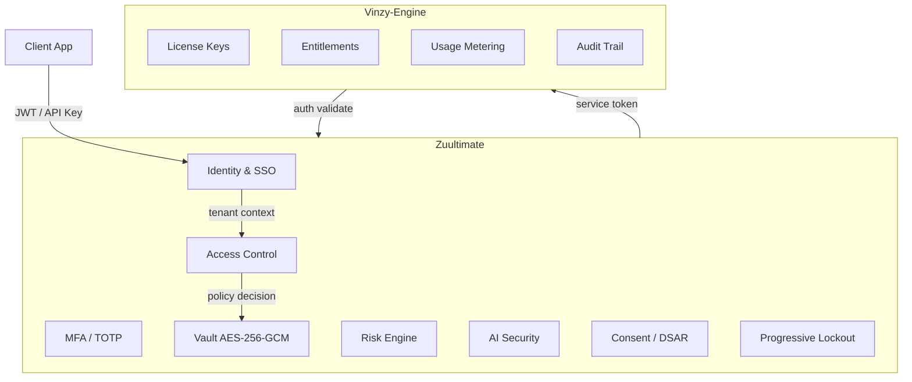

# Zuultimate

Enterprise identity, authorization, and secrets platform. Zuultimate provides the zero-trust backbone for multi-tenant SaaS applications -- handling authentication, policy-based access control, encrypted vaulting, and AI security scanning through a single FastAPI surface.

## Architecture



## Capability Map

| Capability | Status | Module |
|---|---|---|
| OIDC Authentication | GA | identity/sso |
| JWT Token Lifecycle | GA | common/security |
| Refresh Token Rotation | GA | identity/service |
| Token Introspection | GA | identity/router |
| Multi-Tenant Isolation | GA | identity/tenant |
| MFA (TOTP) | GA | identity/mfa |
| Policy-Based Access Control | GA | access |
| AES-256-GCM Vault | GA | vault |
| Consent Management | Beta | identity/consent |
| DSAR Workflow | Beta | identity/dsar |
| Risk Signal Engine | Beta | identity/risk |
| Progressive Lockout | GA | identity/lockout |
| Breached Password Detection | Beta | identity/risk |
| Data Retention Hooks | Beta | identity/retention |
| FIDO2/Passkeys | Roadmap | -- |
| Prometheus Metrics | Roadmap | -- |
| SLO Dashboards | Roadmap | -- |

## Quickstart

```bash
# Start the sandbox (zuultimate + vinzy-engine + redis + swagger)
docker compose -f docker-compose.sandbox.yml up --build

# Seed a demo tenant
python scripts/seed_sandbox.py

# Authenticate
curl -X POST http://localhost:8000/v1/identity/login \
  -H "Content-Type: application/json" \
  -d '{"username": "demo-admin", "password": "DemoPass123!"}'
```

The sandbox provisions a `pro`-plan tenant with full entitlements. Swagger UI is available at `http://localhost:8080`.

## Integration with Vinzy-Engine

Zuultimate serves as the identity authority for the Vinzy-Engine licensing platform. The integration contract is documented in [ZUULTIMATE_CONTRACT.md](https://github.com/chrisarseno/vinzy-engine/blob/main/docs/integration/ZUULTIMATE_CONTRACT.md) inside the vinzy-engine repository.

The provisioning flow works as follows: Vinzy-Engine receives a payment webhook (Stripe or Polar), creates a license, then calls `POST /v1/tenants/provision` on Zuultimate using a shared service token. Zuultimate returns tenant credentials and an API key scoped to the customer's plan tier.

## API Documentation

This platform exposes a full OpenAPI specification. When running the sandbox, interactive documentation is available through the Swagger UI container at `http://localhost:8080`.

The raw OpenAPI JSON is also available at `http://localhost:8000/openapi.json` when the server is running.

## Configuration

All settings use the `ZUUL_` environment variable prefix. Copy `.env.example` to `.env` to get started. At minimum, set `ZUUL_SECRET_KEY` to a cryptographically random value:

```bash
python -c "import secrets; print(secrets.token_urlsafe(48))"
```

## Testing

```bash
pip install -e ".[dev]"
pytest tests/ -q
```

537 tests covering identity, access control, vault, AI security, multi-tenancy, provisioning, consent, DSAR, risk scoring, and lockout.

## License

This project is dual-licensed:

- **AGPL-3.0** -- free for open-source use. See [LICENSE](LICENSE).
- **Commercial License** -- for proprietary use without AGPL obligations.

For commercial licensing inquiries, contact **info@1450enterprises.com**.

Copyright (c) 2025-2026 Chris Arsenault / 1450 Enterprises.
